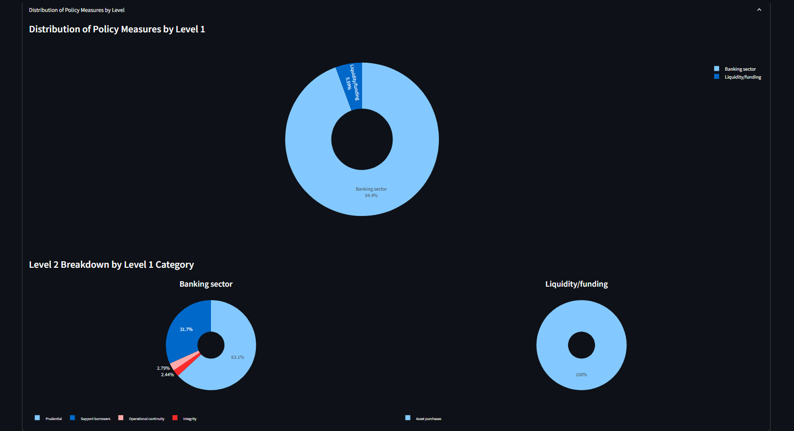

# “COVID-19 Policy Responses in the Financial Sector – Statistical Data Analysis” 

**People participating in the project:**
 - Jakub Ciura 
 - Janusz Chmiel
 - Kacper Błachowiak

  **Advanced Databases** - group 1. - Friday 11:30

----
## Table of contents
- [Title of a project](#title-of-a-project)
  - [Table of contents](#table-of-contents)
  - [Concept of a project](#concept-of-a-project)
  - [Dataset](#dataset)
  - [Data structure](#data-structure)
  - [Architecture of a system](#architecture-of-a-system)
  - [Features of a system](#features-of-a-system)
    - [Filtering](#filtering)
    - [Diagrams:](#diagrams)
      - ["Measures Over Time"](#measures-over-time)
      - ["Measures by Country"](#measures-by-country)
      - ["Distribution of Policy Measures by Level"](#distribution-of-policy-measures-by-level)
      - ["Authority Breakdown and Map"](#authority-breakdown-and-map)
  - [How to use](#how-to-use)
    - [Step 1:](#step-1)
    - [Step 2:](#step-2)
    - [Step 3:](#step-3)
    - [Step 4:](#step-4)
    - [Step 5:](#step-5)
---
## Concept of a project

The project aims to develop a system that collects, stores, and visualizes data related to financial sector policy responses to COVID-19. The process includes importing data from an online dataset into a custom-built relational database and implementing a visualization layer to allow users to interactively analyze the information. 

## Dataset

**COVID-19 Finance Sector Related Policy Responses** - Bojan Tunguz

Click [here](https://www.kaggle.com/datasets/tunguz/covid19-finance-sector-related-policy-responses/data) to view the dataset on Kaggle.

This dataset provides a structured record of global policy responses in the financial sector during the COVID-19 pandemic, maintained by the IMF. It includes dimensions such as country, date, policy type, and description, making it suitable for time-based, statistical, and geographical analysis.

Policies are classified according five main categories: banking sector, financial markets and institutions, insolvency, liquidity/funding, and payments systems (Level 1 policy). Each category has different sub-categories (Level 2 policy measures) and a further more granular classification (Level 3 policy measures).

**Level 1 and 2 policy measures:**
   - Banking sector Crisis management
   - Integrity
   - Operational continuity
   - Prudential
   - Support borrowers
   - Financial Markets/NBFI Market functioning
   - NBFI
   - Public debt management
   - Insolvency Amending bankruptcy filing obligations
   - Enhancing tools for out-of-court debt restr. and workouts
   - Other Insolvency
   - Liquidity/funding Asset purchases
   - Liquidity (incl FX)/ELA
   - Policy rate
   - Other Liquidity
   - Payments systems Consumer protection
   - Easing regulatory requirements
   - Promoting and ensuring avail. of dig. paym. mechan.
   - Other Payments

## Data structure
(here should be added a graph, ie. from https://dbdiagram.io/)

## Architecture of a system
What technologies were used, what is flow of data

## Features of a system

Users are able to filter data using at criteria, such as: 
 - Countries
 - Policy Type
 - Target Group
 - Level
 - Time Range 

    
     
    <em>Filter Options</em>

The following images illustrate sample outputs of the system based on the following selected criteria:

 - **Countries:** Poland, Italy
 - **Policy Type:** Banking Sector
 - **Target Group:** Banking Sector
 - **Level:** Level 1, Level 2
 - **Time Range:** 2020/01/01 - 2025/02/13

### Filtering

The system allows users to filter the data based on multiple criteria. Users can select multiple options simultaneously from each category, enabling precise customization and comparison across different data segments.

    
     
    <em>Measure filter</em>

### Diagrams:

#### "Measures Over Time"

This diagram visualizes the implementation of policy measures over a timeline, allowing users to track how responses evolved throughout the pandemic.

    
     
    <em>**Measures over time**</em>

#### "Measures by Country"

This view helps identify how different countries approached the crisis, comparing the number of actions taken during chosen time period.

    
     
    <em>**Measures by country**</em>

#### "Distribution of Policy Measures by Level"

The chart presents how responsibilities were distributed across different levels.

    
     
    <em>**Distribution by level**</em>

#### "Authority Breakdown and Map"

A geographic and hierarchical visualization showing which authorities enacted policies and in which regions.

    
     
    <em>**Map and authority breakdown**</em>

## How to use:

### Step 1: 
    **Install Postgresql:**
     - sudo apt update
     - sudo apt install postgresql postgresql-contrib
     - sudo -u postgres psql
     - \password postgres
     - \q to exit pqsl

### Step 2:
    **Setup python modules, in the project directory run commands:**
     - python3 -m venv .venv
     - source .venv/bin/activate
     - pip install -r requirements.txt

### Step 3:
    **Setup credentials**
    Create .env file and fill in the fields (check .env.example).
    If you have a default instance of postgres you can copy the contents of .env.example

### Step 4:
    **Setup database**
    run: python setup_database.py
    It will create the necessary tables and insert data.

### Step 5:
    **Start the app**
    run: streamlit run streamlit_app.py
