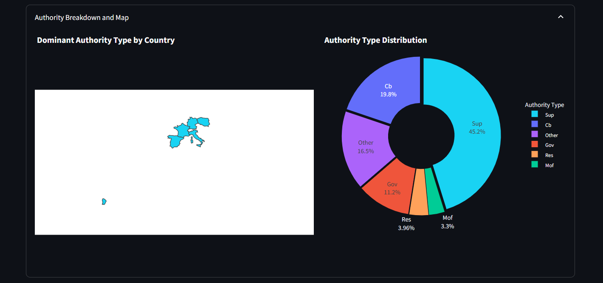

# “COVID-19 Policy Responses in the Financial Sector – Statistical Data Analysis” 

**People participating in the project:**
 - Jakub Ciura 
 - Janusz Chmiel
 - Kacper Błachowiak

  **Advanced Databases** - group 1.  Friday 11:30

----
## Table of contents
- [Title of a project](#title-of-a-project)
  - [Table of contents](#table-of-contents)
  - [Concept of a project](#concept-of-a-project)
  - [Dataset](#dataset)
  - [Data structure](#data-structure)
  - [Architecture of a system](#architecture-of-a-system)
  - [Features of a system](#features-of-a-system)
    - [Filtering](#filtering)
    - [Diagrams:](#diagrams)
      - ["Measures Over Time"](#measures-over-time)
      - ["Measures by Country"](#measures-by-country)
      - ["Distribution of Policy Measures by Level"](#distribution-of-policy-measures-by-level)
      - ["Authority Breakdown and Map"](#authority-breakdown-and-map)
  - [How to use](#how-to-use)
---

## Concept of a project

The project aims to develop a system that collects, stores, and visualizes data related to financial sector policy responses to COVID-19. The process includes importing data from an online dataset into a custom-built relational database and implementing a visualization layer to allow users to interactively analyze the information. 
<br />
## Dataset

**COVID-19 Finance Sector Related Policy Responses** - Bojan Tunguz

Click [here](https://www.kaggle.com/datasets/tunguz/covid19-finance-sector-related-policy-responses/data) to view the dataset on Kaggle.
<br />

This dataset provides a structured record of global policy responses in the financial sector during the COVID-19 pandemic, maintained by the IMF. It includes dimensions such as country, date, policy type, and description, making it suitable for time-based, statistical, and geographical analysis.

Policies are classified according five main categories: banking sector, financial markets and institutions, insolvency, liquidity/funding, and payments systems (Level 1 policy). Each category has different sub-categories (Level 2 policy measures) and a further more granular classification (Level 3 policy measures).
<br />
<br />

**Level 1 policy measures:**
 - Banking sector
 - Financial markets/nbfi
 - Insolvency
 - Liquidity/funding
 - Payment systems
<br />

**Level 2 policy measures:**
 - Amending bankruptcy filing obligations
 - Asset purchases
 - Consumer protection measures and ensuring availability and acceptance of cash
 - Crisis management
 - Easing regulatory requirements
 - Enhancing tools for out-of-court debt restructuring and workouts
 - Integrity
 - Liquidity (incl fx)/ela
 - Market functioning
 - Nbfi
 - Operational continuity
 - Other insolvency
 - Other liquidity
 - Other payments
 - Policy rate
 - Promoting and ensuring availability of digital payment mechanisms
 - Prudential
 - Public debt management
 - Support borrowers
<br />

**Level 3 policy measures:**
 - Adjusting funding strategy
 - Caps on interest rates or fees
 - Credit restructuring with public guarantee
 - Ease credit exposure limits (large exposures, credit limits)
 - Ease other macroprudential measures (eg, dti, ltv)
 - Encourage restructuring of loans
 - Ensure minimal functionality in the primary and secondary markets
 - Ensure public risk disclosures by banks
 - Flexibility in credit information requirements
 - Insurance
 - Lower risks weights for credit with public guarantees
 - Mandatory credit repayment moratorium
 - Market restrictions
 - Other credit repayment moratorium
 - Other crisis management
 - Other integrity
 - Other market functioning
 - Other nbfi
 - Other pdm
 - Other prudential flexibility
 - Other prudential relaxation
 - Other support borrowers
 - Pensions
 - Prioritize or review critical supervisory actions
 - Promoting digital channels in line with aml/cft requirements (via e-kyc, digital signature, and online document
 - Reduce non-essential regulatory reporting requirements for banks
 - Regulatory measures
 - Relaxation in capital requirement (definition of capital, car, risk weights)
 - Relaxation in npe treatment (definition, classification, provisioning)
 - Release/defer capital buffers (conservation, counter-cyclical, systemic)
 - Relief measures on customer identification (e.g. simplified cdd even in case of non-face-to-face relationships)
 - Restrictions on use of profits and resources (e.g. dividends)
 - State guarantees on loans
 - State subsidies, direct loans and tax incentives to facilitate repayments
 - Strengthen crisis management framework
 - Supervisory guidance and expectations
 - Suspension/limitation of banking fees
 - Temporary ease on liquidity requirements
 - Use of recovery and resolution tools
<br />

## Data structure
<br />
<p align="center">
    
    <br>
    <em>Data structure diagram</em>
</p>
<br />

## Architecture of a system

### Technologies used
- **Database**: PostgreSQL
- **Frontend**: Streamlit
- **Backend**: SQLAlchemy


Data flow:

<br />
<br />

## Features of a system

Users are able to filter data using criteria, such as:
 - Countries
 - Policy Type
 - Target Group
 - Level
 - Time Range

<br />
<p align="center">
    
    <br>
    <em>Filter Options</em>
</p>
<br />

**The following images illustrate sample outputs of the system based on the following selected criteria:**

 - **Countries:** Poland, Italy, Germany, France, Spain
 - **Policy Type:** Banking Sector, Asset purchases, Insurance, Liquidity/funding, Regulatory measures
 - **Target Group:** Banking Sector, Asset purchases, Marketing functioning, Payment systems
 - **Level:** Level 1, Level 2
 - **Time Range:** 2020/01/01 - 2022/02/25

<br />

### Filtering

The system allows users to filter the data based on multiple criteria. Users can select multiple options simultaneously from each category, enabling precise customization and comparison across different data segments.

<br />
<p align="center">
    
    <br>
    <em>Measure filter</em>
</p>
<br />

### Diagrams:

#### "Measures Over Time"

This diagram visualizes the implementation of policy measures over a timeline, allowing users to track how responses evolved throughout chosen time period.

<br />
<p align="center">
    
    <br>
    <em>Measures over time</em>
</p>
<br />

#### "Measures by Country"

This view helps identify how different countries approached the crisis, comparing the number of actions taken.

<br />
<p align="center">
    
    <br>
    <em>Measures by country</em>
</p>
<br />

#### "Distribution of Policy Measures by Level"

The chart presents how responsibilities were distributed across different levels.

<br />
<p align="center">
    
    <br>
    <em>Distribution by level</em>
</p>
<br />

#### "Authority Breakdown and Map"

A geographic and hierarchical visualization showing which authorities enacted policies and in which regions.

<br />
<p align="center">
    
    <br>
    <em>Map and authority breakdown</em>
</p>
<br />

## How to use:

### Step 1:
**Install Postgresql:**
   ```bash
    sudo apt update
    sudo apt install postgresql postgresql-contrib
    sudo -u postgres psql
    \password postgres
   ```
to exit psql type `\q`

### Step 2:
**Setup python modules, in the project directory run commands:**
   ```bash
   python3 -m venv .venv
   source .venv/bin/activate
   pip install -r requirements.txt
   ```
### Step 3:
**Setup credentials**
    Create `.env` file and fill in the fields (check `.env.example`).
    If you have a default instance of postgres you can copy the contents of `.env.example`

### Step 4:
**Setup database**
   ```bash
   python setup_database.py
   ```
It will create the necessary tables and insert data.

### Step 5:
**Start the app**
   ```bash
   streamlit run streamlit_app.py
   ```
